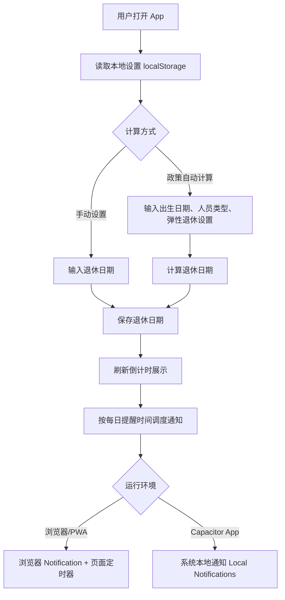

# 退休倒计时 App 架构审核说明

## 1. 项目目标

本项目是一个面向个人使用的退休倒计时 App，核心能力包括：

- 根据中国现行渐进式延迟法定退休年龄政策，按出生日期和人员类型自动计算退休日期。
- 支持手动设置退休日期，用于特殊工种、已确认退休时间或不适用默认规则的情况。
- 展示距离退休的天数、周数、月数和小时数。
- 支持每日固定时间提醒。
- 支持 Web 预览、PWA 形式运行，以及通过 Capacitor 封装为 Android/iOS 原生 App。

## 2. 技术栈

- 前端：HTML、CSS、原生 JavaScript。
- 打包：Vite。
- 移动端封装：Capacitor。
- 原生通知：`@capacitor/local-notifications`。
- CI 打包：GitHub Actions。

当前项目没有引入 React、Vue 等框架，主要原因是功能边界较小，原生 Web 技术可以降低包体和维护复杂度。

## 3. 目录结构

```text
.
├── .github/workflows/android-apk.yml   # GitHub Actions Android APK 构建流程
├── docs/architecture-review.md         # 本文档
├── public/                             # PWA 静态资源
├── src/main.js                         # 主业务逻辑、政策计算、通知调度
├── capacitor.config.json               # Capacitor App 配置
├── index.html                          # 页面结构
├── styles.css                          # 页面样式
├── package.json                        # npm 依赖和脚本
└── MOBILE_BUILD.md                     # 移动端构建说明
```

## 4. 核心业务流程



## 5. 退休政策计算规则

政策依据：

- 《全国人民代表大会常务委员会关于实施渐进式延迟法定退休年龄的决定》
- 《国务院关于渐进式延迟法定退休年龄的办法》
- 《实施弹性退休制度暂行办法》

当前 App 内置三类职工规则：

| 人员类型 | 原法定退休年龄 | 延迟节奏 | 改革后目标年龄 |
| --- | ---: | --- | ---: |
| 男职工 | 60 岁 | 每 4 个月延迟 1 个月 | 63 岁 |
| 女职工，原 55 岁退休 | 55 岁 | 每 4 个月延迟 1 个月 | 58 岁 |
| 女职工，原 50 岁退休 | 50 岁 | 每 2 个月延迟 1 个月 | 55 岁 |

实现逻辑位于 `src/main.js`：

- `RETIREMENT_RULES`：定义三类人员的基准年龄、改革起始出生年月、延迟节奏和最大延迟月数。
- `calculateDelayMonths()`：根据出生年月计算延迟月数。
- `calculateRetirementDate()`：计算改革后法定退休日期，并应用弹性提前/延迟月数。

### 当前假设

- 按出生日期所在月份计算政策延迟月数。
- 退休日期按“出生日期 + 退休年龄月数”计算。
- 弹性提前最长 36 个月，但不会低于原法定退休年龄。
- 弹性延迟最长 36 个月。

### 不覆盖的情况

- 特殊工种提前退休。
- 因病或非因工致残提前退休。
- 地方经办细则差异。
- 养老金最低缴费年限是否满足。
- 机关事业单位、灵活就业人员等可能存在的特殊口径。

这些情况在 UI 中提示用户以当地社保经办口径为准，并支持手动设置退休日期。

## 6. 通知机制

### 浏览器/PWA

浏览器环境使用：

- `Notification.requestPermission()`
- 页面内 `setTimeout()` 调度下一次提醒
- Service Worker 用于展示通知和离线缓存

限制：

- 浏览器完全关闭时，页面定时器无法保证继续运行。
- iOS Safari/PWA 的后台通知能力受系统限制。

### 原生 App

Capacitor 原生环境使用：

- `@capacitor/local-notifications`
- Android 通知 Channel：`daily-retirement-reminder`
- 每日重复通知：`schedule.every = "day"`

优势：

- 不依赖页面一直打开。
- 更接近系统级每日提醒。

注意：

- Android 13+ 需要用户授权通知权限。
- 不同厂商 ROM 的后台限制可能影响极端情况下的通知准时性。

## 7. 数据存储

当前使用浏览器/ WebView 本地存储：

```text
localStorage key: retirement-countdown-settings
```

存储内容包括：

- 计算方式
- 出生日期
- 人员类型
- 弹性退休设置
- 退休日期
- 每日提醒时间
- 提醒文案
- 主题偏好

当前没有后端服务，也不会上传个人数据。

## 8. 构建与发布

### 本地 Web 预览

```powershell
npm install
npm run build
npm run preview
```

### Android 本地构建

```powershell
npm install
npm run build
npx cap add android
npx cap sync android
npx cap open android
```

### GitHub Actions 云端构建

Workflow 文件：

```text
.github/workflows/android-apk.yml
```

流程：

1. Checkout 代码。
2. 安装 Node.js 22。
3. 安装 JDK 21。
4. 安装 Android SDK。
5. `npm install`。
6. `npm run build`。
7. `npx cap add android`。
8. `npx cap sync android`。
9. `./gradlew assembleDebug`。
10. 上传 `app-debug.apk` artifact。

当前生成的是 debug APK，适合内测验证。正式分发需要增加 release 签名、版本号管理和渠道发布流程。

## 9. 安全与隐私

- 无后端服务。
- 无账号系统。
- 无埋点。
- 无网络上传个人出生日期或退休设置。
- GitHub Actions 仅用于打包，不处理用户运行时数据。

需要注意：

- debug APK 不适合正式上架。
- 如未来增加云同步，需要重新评估隐私合规、加密存储和数据删除能力。

## 10. 已知技术债和建议

建议架构审核重点关注：

- 政策规则是否需要改为配置化或表驱动，以便后续政策调整。
- 是否需要引入官方退休年龄对照表数据，避免公式理解偏差。
- 是否需要增加单元测试覆盖典型出生年月边界。
- 是否需要 release 签名流程和版本号策略。
- 是否需要区分 PWA 和原生 App 的通知提示文案。
- 是否需要增加“最低缴费年限提醒”但不直接参与日期计算。

## 11. 后续建议

短期建议：

- 增加退休日期计算单元测试。
- 增加几个政策样例校验，例如男职工 1965 年 1 月、1972 年 9 月等。
- 在 UI 中展示“法定退休日期”和“弹性调整后日期”两个结果。

中期建议：

- 生成 release APK。
- 增加 App 图标和启动页。
- 增加数据导出/备份。
- 如果面向公开发布，增加隐私政策页面。
